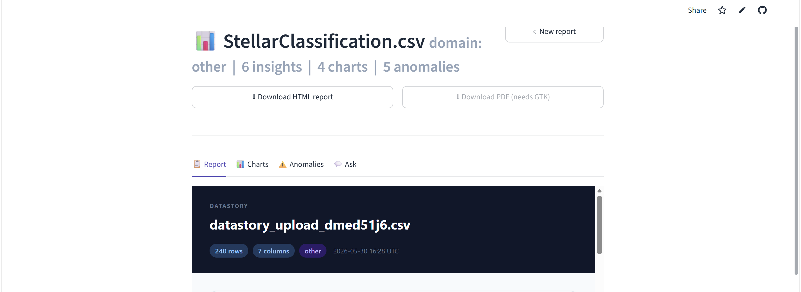
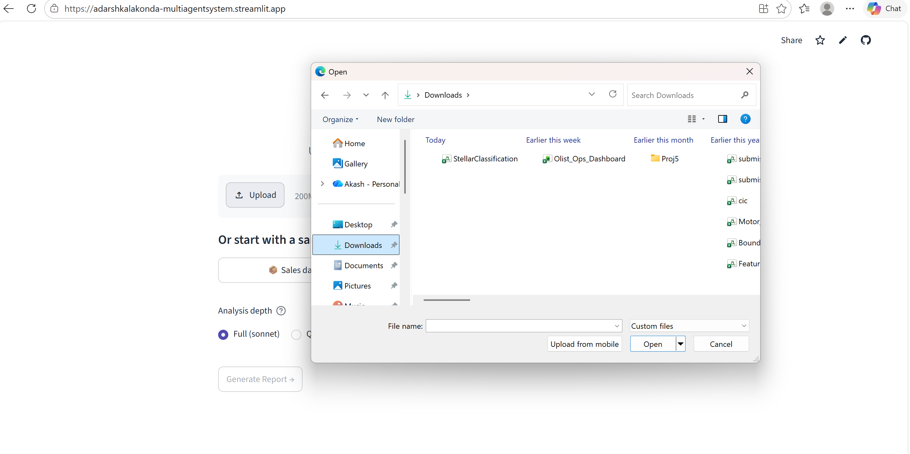
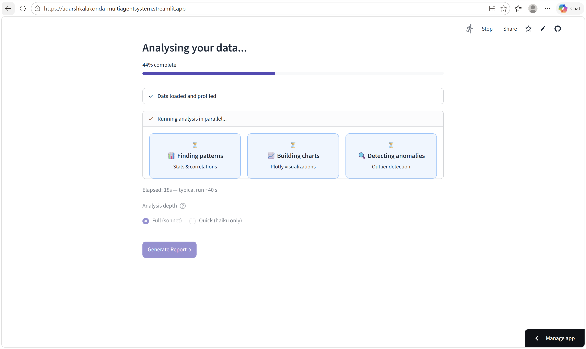
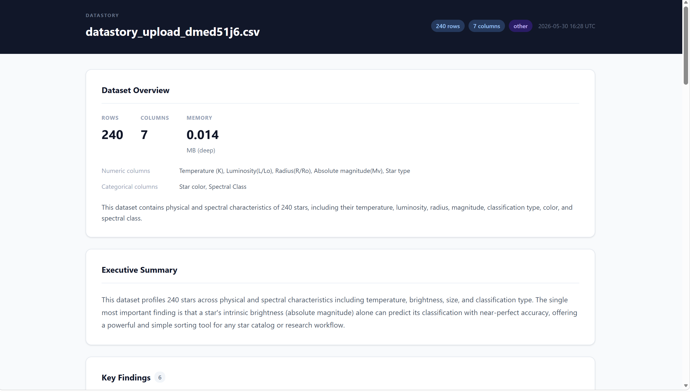
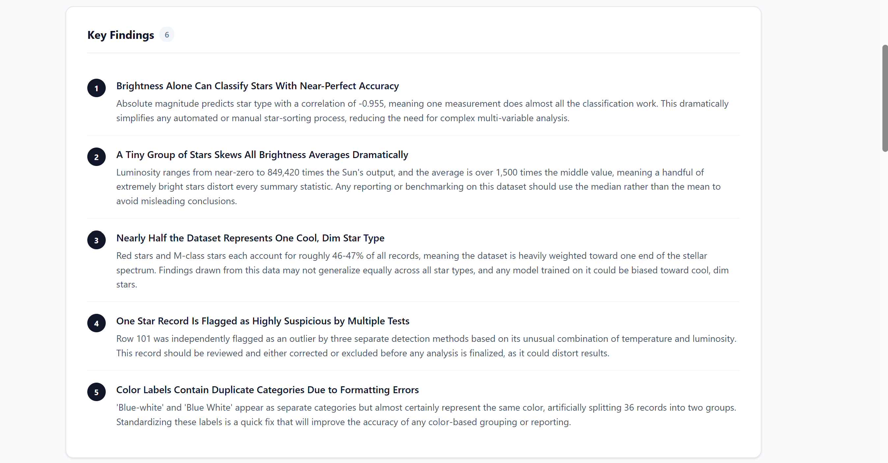
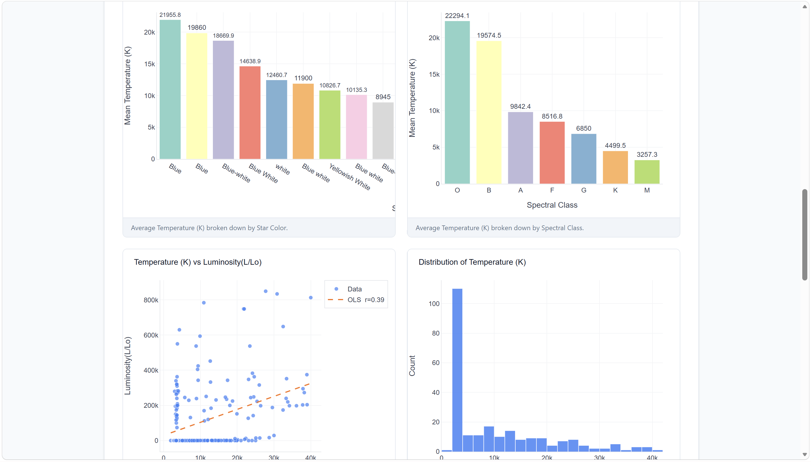
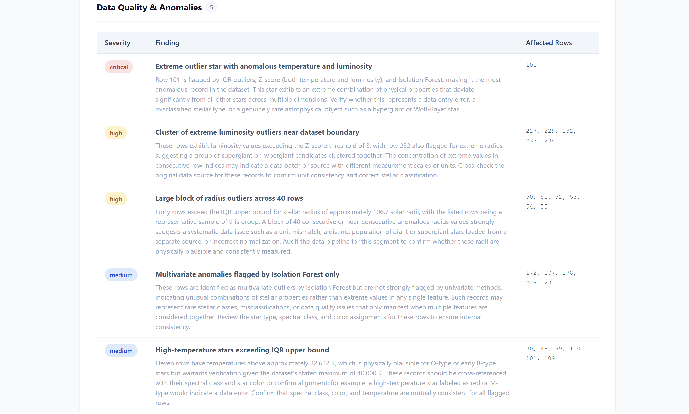

# DataStory 🔍

### *You upload a CSV. Five AI agents argue about it. You get a boardroom-ready report.*

[](https://python.org)
[](https://langchain-ai.github.io/langgraph/)
[](https://streamlit.io)
[](https://anthropic.com)
[](LICENSE)
[](https://adarshkalakonda-multiagentsystem.streamlit.app/)

**[→ Try the live demo](https://adarshkalakonda-multiagentsystem.streamlit.app/)** · No sign-up · Works on any CSV

---



---

## What does it actually do?

Most data tools make you do the analysis. DataStory flips that.

Drop in any CSV, Excel file, or database — and a team of five specialized AI agents immediately gets to work in parallel: one profiles your schema, one hunts for statistical patterns, one builds charts, one runs anomaly detection with machine learning, and one synthesizes everything into a plain-English report your CEO can actually read.

The whole thing runs in under 30 seconds. No SQL. No Python. No pivot tables.

---

## The part that makes engineers lean forward

The five agents don't run one after another — they fan out in parallel using LangGraph's `Send()` API, which means three of them are running *simultaneously* after the profiler completes.

```
                    ┌─ Statistician ──────┐
                    │   (patterns, trends) │
                    │                      │
User CSV ──► Profiler ─┼─ Viz Builder ────┼──► Narrator ──► Report
                    │   (4 smart charts)   │   (plain English)
                    │                      │
                    └─ Anomaly Detector ───┘
                        (IQR + Isolation Forest)
```

**Measured speedup: 1.9× faster than sequential execution.**
Wall-clock time: 19.3s parallel vs 36.1s sequential — on the same hardware, same API.

This isn't just "using AI." It's a multi-agent system with a real architectural reason to exist.

---

## Screenshots

### Upload — dead simple

*Drag-drop or pick one of three preloaded sample datasets. No configuration needed.*

### Live execution — watch the agents work

*Three agents fire simultaneously. The progress cards flip green as each one finishes.*

### The report — not your average output

*Professional header, dataset overview, and LLM-written executive summary.*

### Key findings — written for humans, not engineers

*"A Few Big Sales Are Inflating the Average" — not "mean > median, skew = 2.4"*

### Interactive visualizations

*Four Plotly charts chosen by the AI based on what your data actually looks like.*

### Anomaly detection — powered by ML

*IQR outliers + Z-score + Isolation Forest. Three methods. One table. Severity badges.*

---

## Features

- **Parallel multi-agent execution** — LangGraph `Send()` API dispatches 3 agents simultaneously, not sequentially
- **Intelligent chart selection** — the Viz Builder agent *reasons* about which chart type fits your data, then builds it
- **ML-grade anomaly detection** — combines IQR, Z-score, and sklearn's Isolation Forest for multi-dimensional outlier detection
- **Business-language insights** — findings are written as "Laptops are driving 20% more transactions" not "product_count['Laptop'] = max()"
- **Chat with your data** — after the report, ask follow-up questions in plain English via a built-in Q&A agent
- **Works on anything** — CSV, Excel (.xlsx/.xls), SQLite databases, PostgreSQL connections, or three preloaded samples

---

## Tech stack

| Category | Technology | What it does here |
|---|---|---|
| Agent orchestration | LangGraph | Parallel fan-out, state management, retry logic |
| LLM | Claude Sonnet 4.6 / Haiku 4.5 | Reasoning agents use Sonnet; cheap tasks use Haiku |
| Data analysis | Pandas, SciPy, statsmodels | Correlations, trend detection, statistical tests |
| Anomaly detection | scikit-learn Isolation Forest | Unsupervised ML outlier detection |
| Visualizations | Plotly | Interactive charts embedded in HTML reports |
| Frontend | Streamlit | Upload UI, live agent status, report viewer, chat |
| State schema | Pydantic v2 | Typed, validated state passed between all agents |
| Code sandbox | subprocess + tempfile | Agents write and execute their own Pandas code safely |

---

## Quick start

```bash
# Clone
git clone https://github.com/AdarshKalakonda/MultiAgentSystem.git
cd MultiAgentSystem

# Install
python -m venv .venv
source .venv/bin/activate      # Windows: .venv\Scripts\activate
python -m pip install -r requirements.txt

# Add your Anthropic API key
echo "ANTHROPIC_API_KEY=your-key-here" > .env

# Run
streamlit run app.py
```

Get your API key at [console.anthropic.com](https://console.anthropic.com). First few runs cost pennies — a full report on a 50-row CSV costs roughly $0.02.

---

## Project structure

```
MultiAgentSystem/
├── agents/
│   ├── profiler.py          # Schema detection + LLM domain classification
│   ├── statistician.py      # Correlations, trends, statistical insights
│   ├── viz_builder.py       # Intelligent chart selection + Plotly generation
│   ├── anomaly.py           # IQR + Z-score + Isolation Forest
│   └── narrator.py          # Synthesizes everything into HTML report
├── tools/
│   ├── data_loader.py       # CSV / Excel / SQLite / PostgreSQL ingestion
│   ├── code_executor.py     # Sandboxed Python runner (network-blocked)
│   └── chart_tools.py       # Plotly serialization helpers
├── state/
│   └── schema.py            # Pydantic v2 DataStoryState + all typed models
├── sample_data/
│   ├── sales.csv            # 50 rows — product revenue data
│   ├── hr.csv               # 50 rows — attrition and salary data
│   └── ecommerce.csv        # 50 rows — orders and returns data
├── graph.py                 # LangGraph graph — the parallel wiring
├── app.py                   # Streamlit UI
└── CLAUDE.md                # Project context for Claude Code sessions
```

---

## How the sandbox works

Each analysis agent generates its own Pandas/SciPy code, executes it in a subprocess with a 30-second timeout, and parses the stdout as structured JSON. The sandbox patches `socket.getaddrinfo` to block all network calls at the DNS level — LLM-generated code can't phone home.

This is more robust than `exec()` into a restricted `globals()` dict, which can be escaped by walking `__class__.__mro__`. A subprocess is a hard OS-level boundary.

---

## What this proves (for anyone reading a resume)

- Multi-agent orchestration with real parallel execution (not just sequential chains)
- LangGraph `Send()` API for concurrent branch dispatch and typed state merging
- Code interpreter pattern: LLM writes code → sandboxed execution → structured results
- LLM + ML combination: Isolation Forest anomaly detection with natural language explanation
- Production decisions: retry logic, graceful fallbacks, Pydantic validation throughout
- Full-stack delivery: backend agents + Streamlit UI + cloud deployment

---

## License

MIT — do whatever you want with it. If you build something cool, a ⭐ is always appreciated.

---

<div align="center">
  Built with Python, LangGraph, and too much curiosity about what happens when you let AI agents argue about your spreadsheets.
  <br><br>
  <a href="https://adarshkalakonda-multiagentsystem.streamlit.app/">🚀 Try DataStory live</a>
</div>